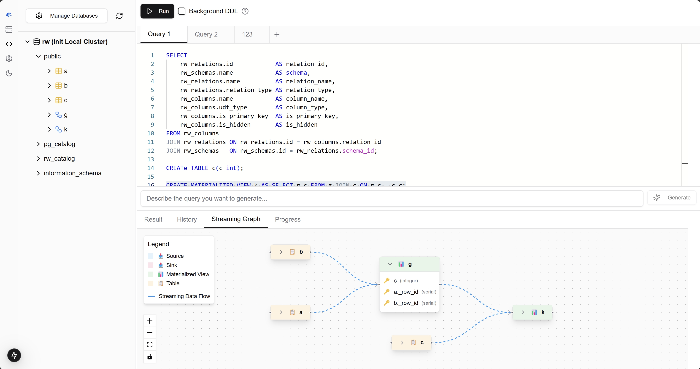

# Wavekit

Wavekit is a self-hosted platform for accessing and managing RisingWave clusters. 



## Features

v1.0:
- [x] SQL Editor
- [x] Materialized View Viewer
- [x] Web UI for Risectl
- [x] Meta Backup
- [x] Collect Diagnostic Data
- [ ] Auto Diagnostic
- [ ] Auto Backup

v2.0:
- [ ] Monitoring
- [ ] UDF Management
- [ ] SSO
- [ ] Access Control
- [ ] SQL Review

## Get Started

### Quick start with Docker (for testing)

The wavekit server requires a PostgreSQL database to store the data. The pgbundle version of the wavekit server is a docker image that bundles the PostgreSQL database and the wavekit server. Note that this is NOT recommended for production, as it does not support multiple nodes.

```shell
# 1. start a risingwave instance for testing
docker run --rm -p 4566:4566 -p 5690:5690 -p 5691:5691 risingwavelabs/risingwave:v2.1.2  

# 2. start the wavekit server in the host network 
sudo docker run -p 8020:8020 --net=host --name wavekit cloudcarver/wavekit:v0.1.2-pgbundle
```

*Note that rootless docker might not be able to use the host network directly, which make it not able to connect to the RisingWave cluster exposed on the host network.*

To persist data, you can use a volume:

```shell
docker run -p 8020:8020 --net=host --name wavekit -v wavekit-data:/var/lib/postgresql cloudcarver/wavekit:v0.1.2-pgbundle
```

### Docker compose

A sample docker compose file is provided in the `examples/docker-compose` directory.

```shell
cd wavekit/examples/docker-compose
docker compose up
```

### High Availability

The wavekit server is a stateless service, you can deploy multiple instances of the wavekit server and use a load balancer to route the requests to the wavekit server. 
