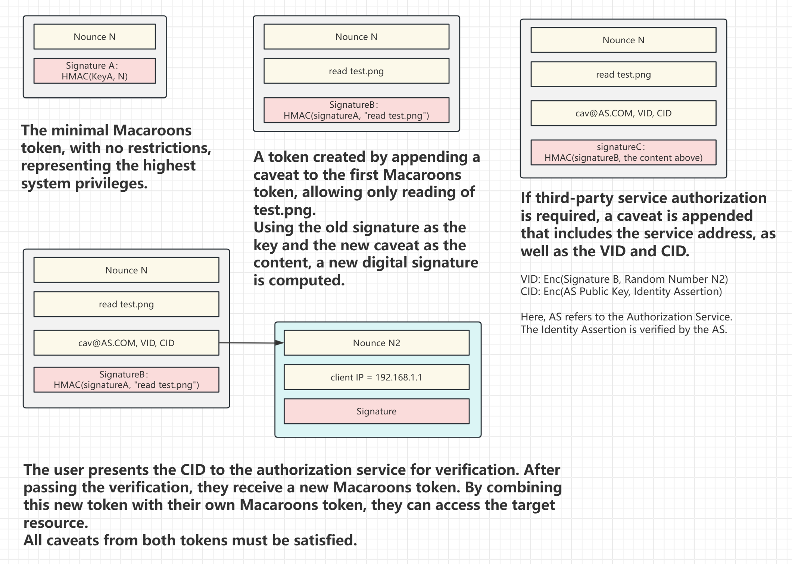

# Macaroons

This document describes the security token system we're using for authentication and authorization. Macaroons are cryptographically-verifiable tokens that provide a secure, flexible approach to access control in our application.

## How does it work

Macaroons are cryptographic tokens that support:
1. Fine-grained, composable authorization
2. Delegation between agents
3. Third-party caveats (delegated authorization)
4. Lightweight computation – ideal for edge devices

**The beauty of Macaroons lies in their ability to append constraints (called caveats) to existing tokens, creating new tokens with narrower scopes.**

### Example

User A receives a token after login: `[Nounce N1] + [caveats: "read images"]`

User A wants to share a specific image from a resource server (TS), say image ID 9527. User A can simply adds a new caveat to issue a new token:

`[Nounce N1] + [caveats: "read images"] + ["ID: 9527"]` → `[new_token_xxx]`

Now, it is safe to share this link to everyone:
https://TS.com/images/9527?token=new_token_xxx

The underlying mechanism is a chain of HMAC signatures:
```
HMAC(K, N1) → Signature A
HMAC(A, "read images") → Signature B
HMAC(B, "ID: 9527") → Signature C
```

The token evolves securely — no need to know the original secret K.

### Third-party caveats

A resource server (TS) can embed an authorization requirement (a third-party caveat) pointing to an auth server (AS). The user gets redirected to AS to validate identity and retrieve a new Macaroon, all without breaking trust boundaries.

The third-party caveat looks like this: `login.AS.com, VID=xxx, CID=yyy`
```
VID = Enc(M.sig, Nounce N2)
CID = Enc(KA, Nounce N2:Identity Assertion)
```

Note that `KA` is the public key of AS, and `N2` is a random number generated by TS.

Users are redirected to AS with `CID` to validate identity, and AS will check the identity assertion and issue a new macaroon starting with `N2`.



